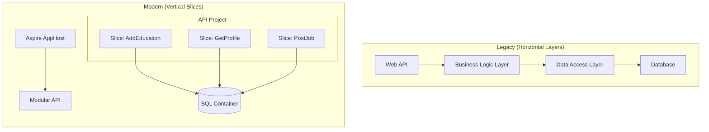

# CareerHub: Legacy to Cloud-Native (.NET 10)

A comprehensive modernization project migrating a legacy **N-Tier .NET Framework 4.6** application into a **Cloud-Native .NET 10 Modular Monolith**, orchestrated by **.NET Aspire**.

This project demonstrates the shift from "Layers" to "Vertical Slices," showcasing modern practices like the REPR pattern, Central Package Management, and Containerized Development.

---

## 📐 Architecture Evolution

### The Legacy State (2018)

The original project followed the classic **N-Tier Architecture**, which separated concerns by technical function. While standard for its time, it resulted in high coupling and "change ripple" (changing one feature required editing 5+ projects).

* **Structure:** 7+ Projects (`Pocos`, `ADODataAccess`, `BusinessLogic`, `WCF`, `WebAPI`, etc.).
* **Data Access:** Manual ADO.NET & early EF6.
* **Logic:** Scattered across "Manager" classes and Controllers.

### The Modern State (2026)

The new architecture utilizes **Vertical Slice Architecture**. Features are self-contained, and the application is orchestrated as a distributed system (even while monolithic) using .NET Aspire.

### Key Technical Changes

| Feature | Legacy Implementation | Modern Implementation (.NET 10) |
| --- | --- | --- |
| **Hosting** | IIS / `Global.asax` | Kestrel / `.NET Aspire` |
| **API Style** | Controllers (`BaseController`) | Minimal APIs (REPR Pattern) |
| **Logic** | `BusinessLogicLayer` (Managers) | **Features Folder** (Mediator/Endpoints) |
| **Data Models** | Mutable POCOs (`class { get; set; }`) | Immutable `records` |
| **Validation** | Manual `if/throw` in Logic | FluentValidation (Pipeline) |
| **Docs** | Swagger UI (Manual Config) | Scalar UI (Native .NET 10) |

---

## 🛠️ Technology Stack

* **Framework:** .NET 10 (Preview/LTS)
* **Language:** C# 14
* **Orchestration:** .NET Aspire
* **Database:** SQL Server (running in Docker via Aspire)
* **ORM:** Entity Framework Core 10
* **Validation:** FluentValidation
* **API Documentation:** Microsoft.AspNetCore.OpenApi + Scalar

---
